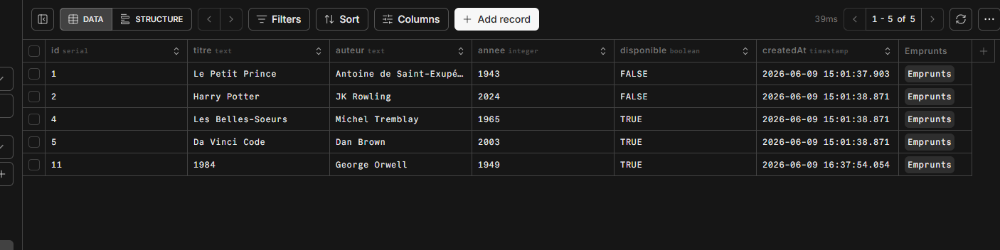

## Membres de l'équipe : Jean-François Pierre, Nadjib Ammour, Amit Chandel

## Description du projet :

Ce projet vise à bâtir un mini back-end pour gérer une bibliothèque avec Node.js et de le connecter à une base de données PostgreSQL hébergée sur Neon en utilisant Prisma.
On peut ainsi manipuler la base de données de la bibliothèque à l'intérieur de notre dossier Node.js pour ajouter des données aux tables, lire des données dans les tables, modifier des données ou supprimer des données dans les tables.

## Objectifs :

Cet exercice vise à nous entraîner à faire le lien entre une base de données et un projet Node.js grâce à Prisma.

## Pour lancer le projet, exécutez les commandes suivantes :

- npm install
- Créez une base de données sur Neon et copiez le DATABASE_URL dans le fichier .env du projet.
- npx prisma db push
- npm run dev

## Pour exécuter les commandes CRUD dans la base de données, exécutez les commandes suivantes :

- npm run read
- npm run updatedb
- npm run deletesdb
- npm run emprunts
